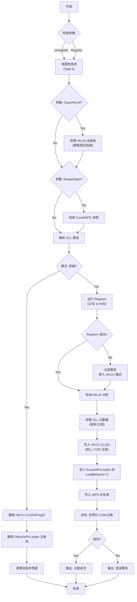

# Register-QSBar.ps1 脚本说明

`Register-QSBar.ps1` 是 QSBar 插件的核心注册脚本，旨在解决 Excel 和 WPS 插件在不同环境（特别是无管理员权限环境）下的注册、卸载和调试问题。

## 功能特点

*   **双模式注册**：尝试使用 `RegAsm` 进行标准的 COM 注册（需要管理员权限），如果失败则自动回退到 **HKCU 用户级注册**（无需管理员权限），确保在受限环境下也能运行。
*   **WPS 兼容性**：自动配置 WPS/ET 的注册表项和白名单，确保插件在 WPS Office 中也能正常加载。
*   **智能清理**：在注册前自动清理 Excel 的 "禁用项" (Disabled Items)，防止因之前的崩溃导致插件被静默禁用。
*   **冲突检测**：检测 HKLM（全机）和 HKCU（当前用户）之间的注册冲突，防止版本不一致。
*   **自检功能**：脚本最后会尝试实例化 COM 对象，立即验证注册是否成功。

## 使用方法

### 1. 快速注册 (推荐)
在脚本所在目录下打开 PowerShell 或 CMD：
```powershell
.\Register-QSBar.ps1
```
*自动查找当前目录或 `..\QSBar\bin\Debug` 下的 `QSBar.dll` 进行注册。*

### 2. 指定 DLL 路径注册
```powershell
.\Register-QSBar.ps1 -DllPath "C:\Path\To\Your\QSBar.dll"
```

### 3. 卸载插件
```powershell
.\Register-QSBar.ps1 -Unregister
```

### 4. 强制清理与重启 (调试用)
如果遇到顽固问题，可以使用以下组合命令：
```powershell
.\Register-QSBar.ps1 -CleanHKLM -RestartApps
```
* `-CleanHKLM`: 需要管理员权限，清理 HKLM 下的残留注册信息。
* `-RestartApps`: 自动结束 Excel 和 WPS 进程，解除文件占用。

## 脚本逻辑流程图 (Mermaid)



## 核心解密：为什么之前修改无效？

很多开发者在开发 Excel 插件时会遇到"明明修改了代码，但 Excel 里显示的还是旧版本"或者"插件根本不显示"的情况。本脚本重点解决了以下三个隐蔽的"拦路虎"：

### 1. "假"编译 (DLL 文件被锁定)
*   **现象**：你修改了代码并点击了生成，VS 提示成功（或者你忽略了错误），但 Excel 里还是旧功能。
*   **原因**：只要 Excel 或 WPS 还在后台运行，`QSBar.dll` 文件就会被**锁定占用**。此时编译器无法覆盖旧文件，导致你实际运行的还是上一次的 DLL。
*   **本脚本方案**：配合项目中的自动清理逻辑，确保在注册前 DLL 是最新的；如果是 `quick_setup.ps1` 则会强制结束 Excel 进程以确保编译成功。

### 2. 静默禁用 (Disabled Items)
*   **现象**：插件完全消失，无论怎么注册都不出来。
*   **原因**：如果插件在之前的运行中崩过一次（比如抛出了未捕获异常），Excel 会为了"保护"用户，悄悄地将该插件加入**"禁用项" (Disabled Items)** 黑名单。一旦进入黑名单，Excel 即使检测到注册表正常，也会拒绝加载它。
*   **本脚本方案**：**Task 0** 步骤会强制扫描并清空 Excel 和 WPS 的禁用项列表，把插件从"黑名单"中拉出来。这是之前脚本失效的主要原因。

### 3. 注册表"幽灵"冲突
*   **现象**：修改了 Ribbon 界面（如删除了 `(Dev)` 标签），但打开 Excel 界面没变化。
*   **原因**：机器上可能同时存在 HKLM (管理员) 和 HKCU (用户) 两套注册表信息，或者残留了 VSTO 的 `Manifest` 键值。Excel 可能会优先读取旧的 HKLM 信息，导致你的 HKCU 新注册被忽略。
*   **本脚本方案**：脚本会优先清理旧的 ProgID 残留，并检测 HKLM 冲突，强制统一使用 HKCU 注册路径，确保 Excel 读取到的是当前开发的版本。

---

## 常见问题排查

| 现象 | 可能原因 | 解决方案 |
| :--- | :--- | :--- |
| **RegAsm 警告 (红色/黄色)** | 当前没有管理员权限 | **无需处理**。脚本会自动进行 HKCU 注册，插件依然可以使用。 |
| **CONFLICT DETECTED** | HKLM (管理员注册) 指向了不同的 DLL | 使用管理员权限运行 `.\Register-QSBar.ps1 -CleanHKLM` 清理冲突。 |
| **Self-Test FAILED** | 缺少依赖库 (如 EPPlus.dll) | 确保所有依赖 DLL 都与 QSBar.dll 在同一目录下。 |
| **Excel 中不显示插件** | 插件被 Excel 禁用 | 脚本已包含自动清理逻辑，尝试重启 Excel。如果仍无效，检查 Excel 的 "文件 -> 选项 -> 加载项 -> 禁用项"。 |
